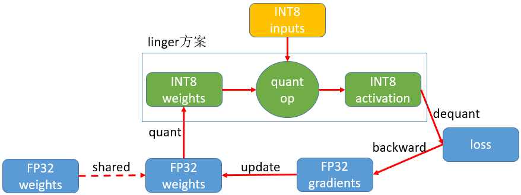

--------------------------------------------------------------------------------
English | [Chinese](../Linger/readme.md)

Linger is a special neural network quantization component for CSK60XX, the AlOT chip of LISTENAI, which is jointly open-sourced by LISTENAI and iFlytek, combining iFlytek's accumulation in deep learning. This component combined with LISTENAI Technology's open source high-performance neural network inference framework [thinker](https://git-in.iflytek.com/RS_RDG_AI_Group/bitbrain/thinker)  to achieve training, inference integration, to help AI developers based on CSK chip to give business fast Al capabilities. Currently linger+thinker tool chain has supported the use of CSK chip in more than 10 AI application scenarios such as computer vision, voice wakeup, speech recognition, offline translation, etc.

## Introduction
The linger is based on PyTorch to deeply customize the LISTENAI LUNA series chip, quantize the activation and weight to 8bit in the forward process of neural network training, and get the quantized lossless 8bit model by parameter adjustment.

## Technical Highlights
### 1. High Ease of Use
linger is a PyTorch-based quantization scheme. Adding one line of linger-related code to the original floating-point training code can complete the replacement of quantization operators, and the quantization training can be completed using the original training process without other complicated settings.

### 2. Good Scalability
linger is based on PyTorch to build quantization operators, so you can add any quantization operator to linger to complete your quantization needs as long as it meets the specifications of PyTorch extension operators.

### 3. Complete Toolchain
The backend is adapted to [thinker](https://git-in.iflytek.com/RS_RDG_AI_Group/bitbrain/thinker) inference engine, thinker inference engine for CSK60XX, which is fully functional and seamlessly integrates quantization training and inference process, while the binary consistency of training and inference is guaranteed.

## Quick Start
1. [Installation](../Linger/Introduction/how_to_use.md)：support pip, source code, docker and other installation methods
2. [Floating-point-fixed-point two-stage quantization training](../Linger/Training_Framework/train_clamp.md): first the constraint training of floating-point network, and then the quantization training fine-tuning for the quantization-friendly floating-point model
3. [ONNX export tutorial](../Linger/Tools/tool.md)：exporting quantized lossless PyTorch models to ONNX format
4. [Complete introductory examples](../Linger/Example/example.md)：provide several newbie-friendly introductory quantization examples

## Quantitative Advancement
  - [Floating-point-fixed-point two-stage quantization training program detailed explanation](../Linger/Training_Framework/train_quant.md)
  - [Use of weight analysis tools and debugging of quantitative onnx export errors](../Linger/FAQ/faq.md)

## Frequently Asked Questions
- [Installation problem solving](../Linger/FAQ/faq.md)
- [Quantification of common problems and notes](../Linger/FAQ/faq.md)

## Data Search
- [linger API](../Linger/Training_Framework/operator.md)
- [List of supported quantization OPs and their restrictions](../Linger/Training_Framework/operator.md)

## Communication and Feedback
- You are welcome to submit bugs and suggestions via Github Issues
- Toolchain course
- Technical Exchange QQ Group
- Technical Communication WeChat Group

## Reference
- [PyTorch](https://github.com/pytorch/pytorch)
- [ONNX](https://github.com/onnx/onnx)

## License
