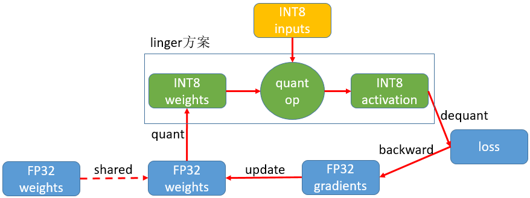

#

--------------------------------------------------------------------------------

Linger是聆思科技AIOT芯片CSK60XX专用神经网络量化训练组件，聆思科技结合科大讯飞在深度学习领域的积累，和科大讯飞联合共同开源本组件。本组件结合聆思科技开源的高性能神经网络推理框架
[thinker](https://github.com/LISTENAI/thinker) 实现训练、推理一体化，助力AI开发者基于CSK芯片给予业务快速赋予AI能力。目前 linger + thinker 工具链已支持聆思芯片在计算机视觉、语音唤醒、语音识别、离线翻译等10多个AI应用场景中的使用。

## 方案简介
linger基于PyTorch对聆思LUNA系列芯片进行深度定制，在神经网络训练的前向过程中将激活和权重量化到8bit，通过参数调整得到量化无损的8bit模型

## 技术亮点
### 1. 易用性高
linger 是基于 PyTorch 的量化方案，在原始浮点训练代码中加入一行 linger 相关代码即可完成进行量化算子的替换，使用原始的训练流程即可完成量化训练，无需其他复杂设置

### 2. 拓展性好
linger 基于 PyTorch 进行量化算子的搭建，因此只要符合 PyTorch 拓展算子的规范，你可以添加任何量化算子到 linger 中来完成你的量化需求

### 3. 工具链完整
linger 后端适配 [thinker](https://github.com/LISTENAI/thinker) 推理引擎，thinker 推理引擎为CSK60XX而生，功能完善，量化训练与推理过程可无缝衔接，同时训练推理二进制一致得到保证

## 快速入门
1. [安装](../Linger/Introduction/how_to_use.md)：支持pip、源码、docker等多种安装方式
2. [浮点-定点两阶段量化训练](../Linger/Training_Framework/train_clamp.md): 先进行浮点网络的约束训练，再针对量化友好的浮点模型进行量化训练微调
3. [onnx导出教程](../Linger/Tools/tool.md)：将量化无损的PyTorch模型导出为ONNX格式的模型
4. [完整入门样例](../Linger/Example/example.md)：提供若干个新手友好的量化入门样例

## 量化进阶
  - [浮点-定点两阶段量化训练方案详解](../Linger/Training_Framework/train_quant.md)
  - [权重分析工具使用及量化onnx导出错误调试](../Linger/FAQ/faq.md)

## 常见问题
- [安装出现问题解决](../Linger/FAQ/faq.md)
- [量化常见问题与注意事项](../Linger/FAQ/faq.md)

## 资料查询
- [linger API](../Linger/Training_Framework/operator.md)
- [支持量化OP列表及其限制说明](../Linger/Training_Framework/operator.md)

## 交流与反馈
- 欢迎您通过 Github Issues 来提交 BUG 与建议
- 技术交流微信群

## 引用
- [PyTorch](https://github.com/pytorch/pytorch)
- [ONNX](https://github.com/onnx/onnx)

## 许可证
