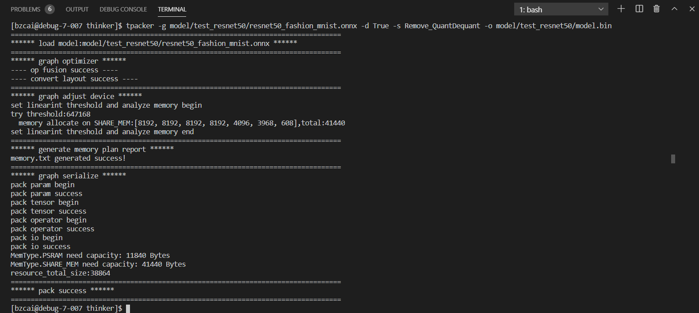
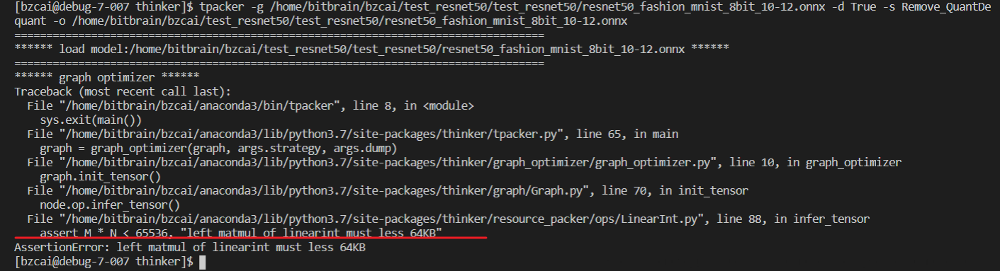
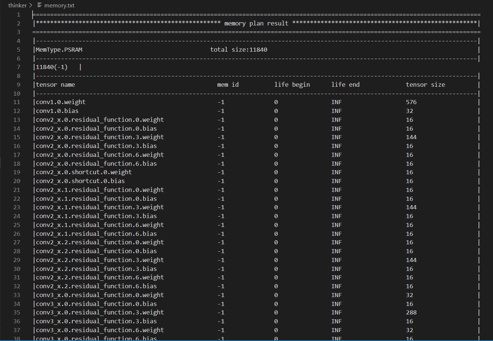

---
sidebar_label: 功能示例  #文档名称
sidebar_position: 1  # 文档排序：1就是排第一
--- 
# 功能示例

# Linger功能示例
## 第一阶段，浮点约束训练
```python
# 得到初始 model
model = Model()

# 使用linger进行浮点约束设置
linger.trace_layers(model, model, dummy_input, fuse_bn=True)
linger.disable_normalize(model.last_layer)
type_modules  = (nn.Conv2d)
normalize_modules = (nn.Conv2d,nn.Linear)
linger.normalize_module(model.mid_conv, type_modules = type_modules, normalize_weight_value=16, normalize_bias_value=16, normalize_output_value=16)
model = linger.normalize_layers(model, normalize_modules = normalize_modules, normalize_weight_value=8, normalize_bias_value=8, normalize_output_value=8)

# 进行浮点网络约束训练
# 训练结束，保存浮点网络

```

## 第二阶段，定点量化微调

```python
# 得到初始 model
model = Model()

# 继承第一阶段的设置，不要进行任何改动
linger.trace_layers(model, model, dummy_input, fuse_bn=True)
linger.disable_normalize(model.last_fc)
type_modules = (nn.Conv2d)
normalize_modules = (nn.Conv2d, nn.Linear)
linger.normalize_module(model.mid_conv, type_modules = type_modules, normalize_weight_value=16, normalize_bias_value=16, normalize_output_value=16)
model = linger.normalize_layers(model, normalize_modules = normalize_modules, normalize_weight_value=8, normalize_bias_value=8, normalize_output_value=8)

# 添加linger量化训练设置
linger.disable_quant(model.last_fc)
quant_modules = (nn.Conv2d, nn.Linear)
model = linger.init(model, quant_modules = quant_modules)

# 加载第一阶段训练好的浮点约束网络参数到 model 里
# 进行量化训练

# 达到无损后，使用 torch.onnx.export 将 model 导出 onnx，将该 onnx 交给后端引擎 thinker 进行处理
with torch.no_grad():
    torch.onnx.export(model, dummy_input, "model.onnx", opset_version=12, input_names=["input"], output_names=["output"])
```


# Thinker功能示例

thinker包括离线打包工具和引擎执行器两部分：
离线打包工具提供onnx计算图的加载解析、图优化、Layout转换、op拆分等功能，并对优化后的计算图进行内存分析，将分析结果和图信息序列化，最终生成资源文件（默认存放在根目录下model.pkg）;
引擎执行器解析资源文件，实现全静态内存分配

## Step1-模型打包
```Shell
tpacker -g xx.onnx [-p venus] [-d True] [-m memory] [-o model.bin]
```
* -g ：输入ONNX模型的路径，必须配置
* -p : 目标平台，目前只支持venus，选填项，默认为venus
* -d : 中间计算图导出开关，选填项，默认为False
* -m : 模型参数在venus上存放的位置，选填项，默认为psram，可选项有flash、psram
* -o : 输出的二进制模型资源路径，选填项，默认为./model.pkg

* 以 Resnet50 模型为例，输入:
```Shell
tpacker -g demo/resnet50/resnet50_fashion_mnist.onnx -d True -s Remove_QuantDequant -o demo/resnet50/model.bin
```
其中 -s Remove_QuantDequant 为保留 Quant 与 Dequant 算子, 若能打包成功，则会提示 : 



若超出硬件或内存限制，则会提示错误要求设计反工 :



最终成功会得到内存分析结果，存储在 memory.txt 中。



## Step2-引擎执行
执行编译后，会对应测试工程test_thinker，执行脚本如下

* 输入数据格式为 input.bin model.bin result.bin  c h w

  * input.bin : 输入的模型二进制数据
  * model.bin : 打包生成优化后的模型二进制数据
  * result.bin: thinker引擎最终生成的二进制结果数据
  * shape : c(通道),h(高度),w(宽度)


以 Resnet50 模型为例，输入:
```Shell
./bin/test_thinker demo/resnet50/input.bin demo/resnet50/model.bin demo/resnet50/result.bin 1 32 32
```