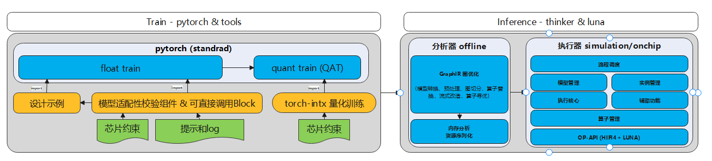
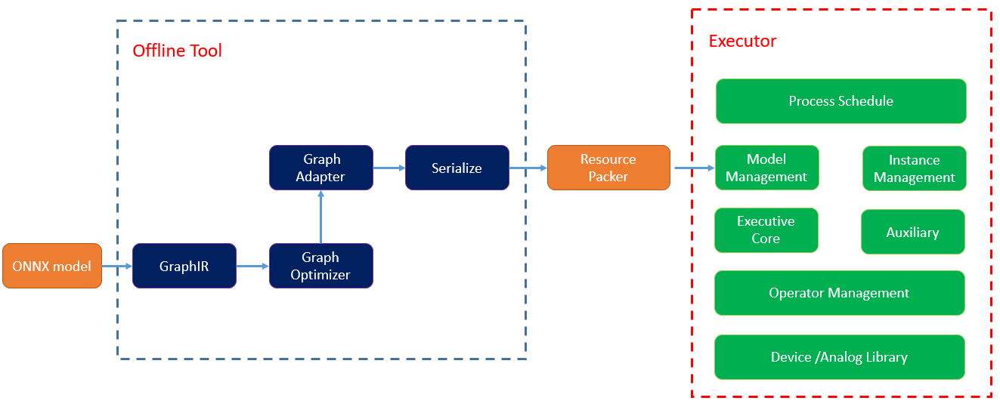

# 介绍

聆思AI生态工具(Linger和Thinker)是聆思科技开发的面向聆思芯片的轻量级神经网络训练和推理框架，其中Linger是神经网络量化训练组件，Thinker是神经网络推理组件。Linger和Thinker搭配使用，可以快速实现模型量化训练和引擎推理，助力于AI开发者快速上线AI业务。目前linger+thinker工具链已支持聆思芯片在计算机视觉、语音唤醒、语音识别、离线翻译等领域的10多个AI场景中应用落地。

# Linger介绍

linger基于PyTorch对聆思LUNA系列芯片进行深度定制，在神经网络训练的前向过程中将激活和权重量化到8bit，通过参数调整得到量化无损的8bit模型

## Linger技术亮点
### 1. 易用性高
linger 是基于 PyTorch 的量化方案，在原始浮点训练代码中加入一行 linger 相关代码即可完成进行量化算子的替换，使用原始的训练流程即可完成量化训练，无需其他复杂设置

### 2. 拓展性好
linger 基于 PyTorch 进行量化算子的搭建，因此只要符合 PyTorch 拓展算子的规范，你可以添加任何量化算子到 linger 中来完成你的量化需求

### 3. 工具链完整
linger 后端适配 [thinker](https://github.com/LISTENAI/thinker) 推理引擎，thinker 推理引擎为CSK60XX而生，功能完善，量化训练与推理过程可无缝衔接，同时训练推理二进制一致得到保证

# Thinker介绍

Thinker是聆思科技开发的轻量级神经网络推理框架，结合另一个聆思开源的量化训练工具[linger](https://github.com/LISTENAI/linger)可实现产业级深度学习平台，
集深度学习量化训练和引擎推理、LUNA器件库和丰富的工具组件于一体。聆思生态工具链（linger+thinker）是专为聆思AIOT芯片（目前只支持CSK60xx）研发，
其中推理引擎框架Thinker助力开发者在聆思VENUS芯片上快速上线AI业务，帮助越来越多嵌入式尤其是AIOT产品实现AI赋能，助力产业智能化升级。
目前linger+thinker工具链已支持聆思芯片在计算机视觉、语音唤醒、语音识别、离线翻译等领域的10多个AI场景中应用落地。
***
## Thinker框架特点

### 1. 超轻量
如上述框架示意图所示，Thinker框架中包含两个部分：离线分析工具和引擎执行器
离线分析工具中包含了大部分的计算图预处理部分，包括图融合、图优化和图适配等功能，模拟执行器功能，提前分配好内存，将执行器中非计算部分的功能尽量剥离。
引擎执行器主要负责计算部分以及其它辅助调试功能（可选），代码精简，纯C语言实现，无任何依赖，使用调研示例demo，基本不用修改就可方便地部署到CSKXX设备中。

### 2. 通用性
对于常规的CV模型，经过linger的量化训练导出计算图后，一键打包部署。支持多输入多输出计算图，支持动态输入（输入大小可变），支持CV模型中32个常见的量化算子，[详见算子支持列表](../Thinker/Inference_Engine/operator.md)。

### 3. 高性能
引擎执行器专门针对CSK60XX的VENUS架构进行了适配，集成核心运算的LUNA库，通过手写自定义指令码方式充分发挥LUNA的算力，单线程下运行常见CV模型能接近设备算力峰值。
thinker+linger工具链支持全低精度计算(int8/int16)以提升推理性能，并对相关指令进行了适配。相对于浮点模型，量化模型能减少50%-75%的参数量，加快了数据存取速度和提升运算效率。
***