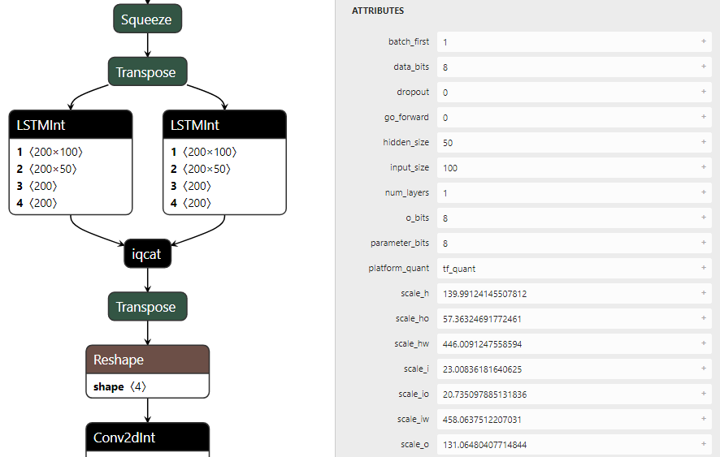
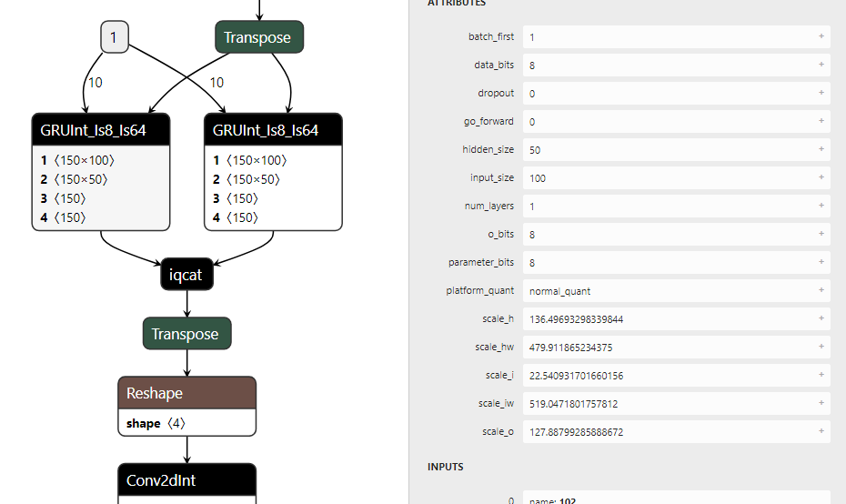

# 目前支持量化的op列表如下

## 算子目录
| **Operator**|**LUNA**|
| ------ | ------ |
| [iqAdd](#iqadd) | Yes |
| [iqMul](#iqmul) | Yes |
| [iqCat](#iqcat) | Yes |
|[iqClamp](#iqclamp)|Yes|
|[iqSigmoid](#iqsigmoid)|Yes|
|[Relu](#relu)|Yes|
|[Clip](#clip)|Yes|
|[MaxPool2d](#maxpool)|Yes|
|[AvgPool2dInt](#avgpool2dint)|Yes|
|[Conv2dInt](#conv2dint)|Yes|
|[ConvTranspose2dInt](#convtranspose2dint)|Yes|
|[BatchNorm2dInt](#batchnorm2dint)|Yes|
|[BatchNorm1dInt](#batchnorm1dint)|Yes|
|[LinearInt](#linearint)|Yes|
|[LSTMInt](#lstmint)|Yes|
|[LSTMInt_Is8_Is64](#lstmint_is8_is64)|Yes|
|[LSTMInt_Is8_Is64_If32_If32](#lstmint_is8_is64_if32_if32)|Yes|
|[GRUInt](#gruint)|Yes|
|[GRUInt_Is8_Is64](#gruint_is8_is64)|Yes|
|[GRUInt_Is8_Is64_If32](#gruint_is8_is64_if32)|Yes|
|[Quant](#Quant)|Yes|
|[Dequant](#Dequant)|Yes|
|[BmmInt](#bmmint)|Yes|

------------
# Operator 命名规则
`(MajorName)[_Inputs_Outputs]`
## MajorName 必需
Operator 主名字,名字内部不允许有符号,仅英文和数字。例如iqMul
## Inputs Outputs 可选
描述Operator 的输入和输出的信息，输入格式为IXB,输出格式为OXB
其中I表示输入，O表示输出，X表示数据类型，B表示数据宽度。
XB组合为ARM NEON like类型定义

| CType   |  X    | B   | 组合 |
| ---     |  ---  | --- | ---- |
|int8_t   |  s    | 8   | s8   |
|uint8_t  |  u    | 8   | u8   |
|int16_t  |  s    | 16  | s16  |
|uint16_t |  u    | 16  | u16  |
|int32_t  |  s    | 32  | s32  |
|uint32_t |  u    | 32  | u32  |
|int64_t  |  s    | 64  | s64  |
|uint64_t |  u    | 64  | u64  |
|float16  |  f    | 16  | f16  |
|float    |  f    | 32  | f32  |
|double   |  f    | 64  | f64  |

--------------
# 术语说明
## 量化方式
在部分op的属性中有platform_quant属性，标识平台相关量化方法，说明如下:

- luna_quant: castor全量化方式(int8->int8)，针对castor硬件量化，浮点到定点round采用的(x+0.5).floor()计算

$$(\lfloor x\_int*\frac{scale\_z}{scale\_x}+0.5\rfloor+\lfloor y\_int*\frac{scale\_z}{scale\_y}+0.5\rfloor).int().clamp(-128,127)$$

## Scale说明
- scale_i: Input的scale, scale_x,scale_1,scale_2, scale_y同理, bits可以取8，16等

$$\frac{2^{bits-1}-1}{running\_i}$$

- scale_w: Weight的scale, scale_iw, scale_hw同理, bits可以取8，16等

$$\frac{2^{bits-1}-1}{weight.abs().max()}$$

- scale_o: Output的scale, bits可以取8，16等

$$\frac{2^{bits-1}-1}{running\_o}$$

  
## Mode参数值
- mode: 所有模式下的device信息

## onnx类型值

### 类型说明
|Group|Types|Description|
|---|---|---|
Floating Point Types|FLOAT16, FLOAT32, FLOAT64|Values adhering to the IEEE 754-2008 standard representation of floating-point data.
Signed Integer Types|INT8, INT16, INT32, INT64|Signed integers are supported for 8-64 bit widths.
Unsigned Integer Types|UINT8, UINT16|Unsigned integers of 8 or 16 bits are supported.
Complex Types|COMPLEX64, COMPLEX128|A complex number with either 32- or 64-bit real and imaginary parts.
Other|STRING|Strings represent textual data. All strings are encoded using UTF-8.
Other|BOOL|Boolean values represent data with only two values, typically true and false.

### 类型和值

| 类型 | 值|
|---|---|
|UNDEFINED | 0|
|FLOAT32   | 1|
|UINT8     | 2|
|INT8      | 3|
|UINT16    | 4|
|INT16     | 5|
|INT32     | 6|
|INT64     | 7|
|STR       | 8|
|BOOL      | 9|
|FLOAT16   |10|
|UINT32    |12|
|UINT64    |13|
|COMPLEX64 |14|
|COMPLEX128|15|
|BFLOAT16  |16|
------

# iqAdd

量化数据加法,由linger导出
### Inputs
- x:T,第1个操作tensor
- y:T,第2个操作tensor
### Outputs
- o:T,结果
### Attr
- scale_x:float,required,x的scale
- scale_y:float,required,y的scale
- scale_o:float,required,输出值o的scale
- platform_quant:string,required,支持包括luna_quant，默认为luna_quant
- mode: string, required

### Type Constraints
-T:int8,int16,int32

------------

# iqMul

- 量化数据乘法
- linger导出

### Inputs
- x:T,第1个操作tensor
- y:T,第2个操作tensor
### Outputs
- o:T,乘法结果
### Attr
- scale_x:float,required,x的scale
- scale_y:float,required,y的scale
- scale_o:float,required,输出值o的scale
- platform_quant:string,required,支持包括luna_quant，默认为luna_quant

### Type Constraints
-T:tensor(int8),tensor(int16),tensor(int32)

---------

# iqCat

- tensor cat 操作
- linger导出

### Inputs（1 - ∞）

- x0:T,第0个tensor
- x1:T,第1个tensor
- x2:T,第2个tensor
- ...

### Outputs

- o:T,concat输出tensor
- linger导出
  
### Attr

`个数与inputs相同`
- scale_x_0:float,required,第0个tensor的scale
- scale_x_1:float,required,第1个tensor的scale
- scale_x_2:float,required,第2个tensor的scale
- ...
- dim:int,required,concat的轴，取值[-r, r-1],其中 r = rank(inputs)
- scale_o:float,required,concat后o的tensor
- platform_quant:string,required,平台量化配置，支持包括luna_quant，默认为luna_quant

### Type Constraints
- T:int8
### OnnxInfer Implementation
- 会被自动解析为对输入分别做requant操作，再调用原始的concat算子实现，采用普通的scale转换方式进行requant操作之后concat

---------
# iqClamp

- 数据截断
- linger导出

### Inputs
- x:T,需要截断的tensor
### Outputs
- y:T,截断后的结果 
### Attr
- scale_x:float,required,输入x的scale
- scale_o:float,required,输出y的scale
- platform_quant:string,required,平台属性
- min:float,required,clamp最小值
- max:float,required,clamp最大值

### Type Constraints
-T:tensor(int8)

---------

# iqSigmoid
- 数据sigmoid激活
- linger导出
### Inputs
- x:T1,输入tensor

### Outputs
- y:T2,sigmoid后的结果

### Attr
- scale_x:float,required,输入x的scale
- scale_o:float,required,输出y的scale
- platform_quant:string,required,平台属性
### Type Constraints
- T1:tensor(int8)
- T2:tensor(uint8)

---------

# Relu

- y = max(0, x)

### Inputs
- x:T,输入tensor

### Outputs
- y:T,relu后的结果

### Type Constraints
- T:tensor(int8),tensor(int32),tensor(float)
  
### OnnxInfer Implementation
= 此处的relu算子为自定义op, domain=onnxinfer, 支持int8的输入输出, 同时也支持原始relu算子的多种数据类型的输入

---------
# Clip

- Clip算子为Relu6的导出模式，为标准的onnx节点，支持int8的输入输出
- 与clamp区别:clip有3个输入，1个输出，即min_thresh和max_thresh作为输入，clamp的min和max是属性

### Inputs
- x:T,输入数据tensor
- min_thresh:T,截断的最小值
- max_thresh:T,截断的最大值

### Outputs
- y:T,截断后的输出tensor

### Type Constraints
- T:tensor(int8), tensor(float)

--------

# AvgPool2dInt
- linger导出
### Inputs
- x:T,格式(N x C x H x W),输入tensor
### Outputs
- y:T,格式(N x C x H x W),输出tensor

### Attr
- kernel_shape:int2,required,pool2d 的kernel大小
- strides:int2,required,pool2d 的stride
- pads:int2,required,pool2d的pad大小
- ceil_mode:bool,是否为ceil模式
- data_bits:int,required,输入数据bit数，当前仅仅支持8
- scale_x:float,required,输入tensor的scale
- scale_o:float,required,输出tensor的scale
- o_bits:输出bit数,如果没有该属性,意味着float
- platform_quant:string,required,支持luna_quant

### Type Constraints
- T: tensor(int8)

---------

# Conv2dInt

- linger导出

### Inputs
- x:T1,格式(N X C X H X W),卷积的激活值
- weight:T1,格式(M x C/group x kH x kW),M是feature maps数量,C是channels数量,kH和kW是feature map的高和长
- bias:T2,optional,1D bias
### Outputs
- o:T3,格式(N X C X H X W),卷积后的输出
### Attr
- dilations:int or int2,required
- group:int,required,输入到输出的卷积块数
- kernel_shape:int or int2,required,卷积核大小
- pads:int or int2,required,两边pad 0的大小
- strides:int or int2,required,卷积的stride
- scale_x:float,required,输入x的feature maps的scale
- scale_w:float,required,weight的scale
- scale_o:float,optional,输出o的scale,没有该属性意味着浮点输出
- data_bits:int,required,x的量化bit数,比如8 表示8bit量化的
- parameter_bits:int,required,weight的量化bit数,比如8 表示8bit量化的
- o_bits:int,optional,输出的o的量化bit数,比如8 表示8bit量化的,没有该属性意味着浮点输出
- platform_quant:string,平台属性,luna_quant, mlu_quant,gpu_quant,
  `如果torchintx处设置platform_quant为mlu_quant/gpu_quant,则out_bits=None,onnx中则不会有o_bits属性`

### Type Constraints
- T1:tensor(int8)
- T2:tensor(int16),tensor(int32),tensor(float)
- T3:tensor(int8),tensor(float)
  
### OnnxInfer Implementation
- 在onnxinfer中运行时，会被解析成ConvInteger + Add(bias) + Requant 的操作来实现

---------

# ConvTranspose2dInt

- linger导出

### Inputs
- x:T1,格式(N x C x H x W),输入反卷积数据
- weight:T1,格式(C x M/group x kH x kW),反卷积的weight,M是feature map数,C是通道数，kH和kW是feaaturemap的高和长
- bias:T2,optional,1D bias

### Outputs
- o:T3,格式(N x C x H x W),反卷积结果

### Attr
- dilations:int or int2,required
- group:int,required,输入到输出的反卷积块数
- kernel_shape:int or int2,required,反卷积核大小
- pads:int or int2,required,两边pad 0的大小,``dilation * (kernel_size - 1) - padding``
- strides:int or int2,required,反卷积的stride
- output_padding:int or int2,required,反卷积输出的额外pad大小  
- scale_x:float,required,输入x的feature maps的scale
- scale_w:float,required,weight的scale
- scale_o:float,optional,输出o的scale,没有该属性意味着浮点输出
- data_bits:int,required,x的量化bit数,比如8 表示8bit量化的
- parameter_bits:int,required,weight的量化bit数,比如8 表示8bit量化的
- o_bits:int,optional,输出的o的量化bit数,比如8 表示8bit量化的,没有该属性意味着浮点输出
- platform_quant:string,平台属性,luna_quant, mlu_quant,gpu_quant,
  `如果torchintx处设置platform_quant为mlu_quant/gpu_quant,则out_bits=None,onnx中则不会有o_bits属性`

### Type Constraints
- T1:tensor(int8)
- T2:tensor(int16),tensor(int32),tensor(float)
- T3:tensor(int8),tensor(float)

### OnnxInfer Implementation
- 在onnxinfer中运行时，会被解析为自定义算子ConvTranspose2dInteger + Requant 的操作

---------

# BatchNorm2dInt

- linger导出
- 算法:`o = x * mul_w + add_b`
  
### Inputs

- x:T,格式(N x C X H x W),batchnorm的输入feature maps
- mul_w:T,batch_norm 化简后的乘法系数
- add_b:T,batch_norm 化简后的加法系数

### Outputs
- o:T,格式(N x C X H x W),输出tensor
### Attr
- scale_mul_x:float,required,乘法操作的x的scale
- scale_mul_w:float,required,乘法操作的w的scale
- scale_mul_o:float,required,乘法输出的scale
- scale_add_b:float,required,加法的weight b的scale
- scale_add_o:float,required,输出o的scale
- data_bits:int,required,输入数据bit数
- parameter_bits:int,required,默认为8
- o_bits:int,required,输出bit数,也代表着中间乘法操作后(加法前)的中间运算bit数

### Type Constraints
- T:tensor(int8),tensor(int16),tensor(int32),

### OnnxInfer Implementation

- 此处BatchNorm2dInt实现为乘加操作

---------

# LinearInt

- linger导出

### Inputs
- x:T1,格式(B x M x K),输入全连接数据
- weight:T1,格式(K x N),全连接的weight
- bias:T2,optional,1D bias

### Outputs
- o:T3,格式(B x N),全连接

### Attr
- scale_x:float,required,输入x的feature maps的scale
- scale_w:float,required,weight的scale
- scale_o:float,optional,输出o的scale,没有该属性意味着浮点输出
- data_bits:int,required,x的量化bit数,比如8 表示8bit量化的
- parameter_bits:int,required,weight的量化bit数,比如8 表示8bit量化的
- o_bits:int,optional,输出的o的量化bit数,比如8 表示8bit量化的,没有该属性意味着浮点输出
- platform_quant:string,luna_quant, mlu_quant,gpu_quant,
  `如果torchintx处设置platform_quant为mlu_quant/gpu_quant,则out_bits=None,onnx中则不会有o_bits属性`
  

### Type Constraints
- T1:tensor(int8)
- T2:tensor(int16),tensor(int32),tensor(float)
- T3:tensor(int8),tensor(float)

### OnnxInfer Implementation
- 在onnxinfer中运行时，会被解析成 MatMulInteger + Add(bias) + Requant 的操作来实现

---------

# LSTMInt

### Inputs
- x:T1,格式(B x T x D)或者(T x B x D),输入数据,B 是batch，T是time，D是input dim
- weight_ih:T1,输入连接的weight
- weight_hh:T1,hidden连接的weight
- bias_ih:T2,输入连接的weight后的bias
- bias_hh:T2,hidden连接的weight后的bias

### Outputs
- output:有o_bits属性为T3，没有为T4
- hidden_state:T4
- cell_state:T4

### Attr
- scale_i:float,required,输入数据scale
- scale_h:float,required,hidden scale
- scale_iw:float,required,weight_ih的scale
- scale_hw:float,required,weight_hh的scale
- scale_io:float,optional,输入矩阵计算(Wi*Xi+Bi)的输出量化scale
- scale_ho:float,optional,隐层矩阵计算(Wh*H+Bh)的输出量化scale
- scale_o:float,optional,如果o_bits没有,scale_o为空
- o_bits:int,optional,觉得输出是否做量化
- platform_quant:string,required,对应不同的硬件平台
- data_bits:int,required，输入量化bit数
- parameter_bits:int,required,weight_iw,weight_hw的数据位数
- batch_first:int,required,1表明输入数据是否是B*T*D模式，0表明是T*B*D输入格式
- dropout:float,required,对应标准lstm中的dropout操作，量化是全部为0，不做dropout操作
- go_gorward:int,required,针对双向lstm的量化导出，1表示正向，0表示反向
- num_layers:int,required,量化只支持num_layers=1
- input_size:int,required,输入数据维度
- hidden_size:int,required,隐层状态维度
- table_len:int,optional,如果使用查表法,有此属性,表示表长度
- sigmoid_bound:float,optional,sigmoid查表计算的查表边界
- tanh_bound:float,optional,tanh查表计算的查表边界

### Type Constraints
- T1:tensor(int8)
- T2:tensor(int32)
- T3:tensor(int8)
- T4:tensor(float32)

  

---------

# LSTMInt_Is8_Is64

### Inputs
- x:T1,格式(B x T x D)或者(T x B x D),输入数据,B 是batch，T是time，D是input dim
- batch_seq:T5,输入x的长度tensor，表示成list为[T0,T1,...],T0表示输入x的第0个tensor的T的实际长度,list长度为B
- weight_ih:T1,输入连接的weight
- weight_hh:T1,hidden连接的weight
- bias_ih:T2,输入连接的weight后的bias
- bias_hh:T2,hidden连接的weight后的bias

### Outputs
- output:有o_bits属性为T3，没有为T4
- hidden_state:T4
- cell_state:T4

### Attr
- 和LSTMInt一致

### Type Constraints
- T1:tensor(int8)
- T2:tensor(int32)
- T3:tensor(int8)
- T4:tensor(float32)
- T5:tensor(int64)

  

-------------------------

# LSTMInt_Is8_Is64_If32_If32

### Inputs
- x:T1,格式(B x T x D)或者(T x B x D),输入数据,B 是batch，T是time，D是input dim
- batch_seq:T5,输入x的长度tensor，表示成list为[T0,T1,...],T0表示输入x的第0个tensor的T的实际长度,list长度为B
- hidden_state:T4,隐层单元输入
- cell_state:T4,记忆单元输入
- weight_ih:T1,输入连接的weight
- weight_hh:T1,hidden连接的weight
- bias_ih:T2,输入连接的weight后的bias
- bias_hh:T2,hidden连接的weight后的bias

### Outputs
- output:有o_bits属性为T3，没有为T4
- hidden_state:T4
- cell_state:T4

### Attr
- 和LSTMInt一致

### Type Constraints
- T1:tensor(int8)
- T2:tensor(int32)
- T3:tensor(int8)
- T4:tensor(float32)
- T5:tensor(int64)

  

-------------------------

# GRUInt

### Inputs
- x:T1,格式(B x T x D)或(T x B x D),输入数据,B 是batch，T是time，D是input dim
- weight_ih:T1,输入连接的weight
- weight_hh:T1,hidden连接的weight
- bias_ih:T2,输入连接的weight后的bias
- bias_hh:T2,hidden连接的weight后的bias

### Outputs
- output:T3
- hidden:T4

### Attr
- scale_i:float,required,输入数据scale
- scale_h:float,required,hidden scale
- scale_iw:float,required,weight_ih的scale
- scale_hw:float,required,weight_hh的scale
- scale_io:float,optional,输入矩阵计算(Wi*Xi+Bi)的输出量化scale
- scale_ho:float,optional,隐层矩阵计算(Wh*H+Bh)的输出量化scale
- scale_o:float,optional,如果o_bits没有,scale_o为空
- o_bits:int,optional,觉得输出是否做量化
- platform_quant:string,required
- data_bits:int,required
- parameter_bits:int,required,weight_iw,weight_hw的数据位数
- batch_first:int,required,1表明输入数据是否是B*T*D模式，0表明是T*B*D输入格式
- dropout:float,required,对应标准lstm中的dropout操作，量化是全部为0，不做dropout操作
- go_gorward:int,required,针对双向lstm的量化导出，1表示正向，0表示反向
- num_layers:int,required,量化只支持num_layers=1
- input_size:int,required,输入数据维度
- hidden_size:int,required,隐层状态维度
- table_len:int,optional,如果使用查表法,有此属性,表示表长度
- sigmoid_bound:float,optional,sigmoid查表计算的查表边界
- tanh_bound:float,optional,tanh查表计算的查表边界

### Type Constraints
- T1:tensor(int8)
- T2:tensor(int32)
- T3:tensor(int8)
- T4:tensor(float32)
- T5:tensor(int64)

  

---------

# GRUInt_Is8_Is64

### Inputs
- x:T1,格式(B x T x D)或(T x B x D),输入数据,B 是batch，T是time，D是input dim
- batch_seq:T5,输入x的长度tensor，表示成list为[T0,T1,...],T0表示输入x的第0个tensor的T的实际长度,list长度为B
- weight_ih:T1,输入连接的weight
- weight_hh:T1,hidden连接的weight
- bias_ih:T2,输入连接的weight后的bias
- bias_hh:T2,hidden连接的weight后的bias

### Outputs
- output:T3
- hidden:T4

### Attr
- 与GRUInt一致

### Type Constraints
- T1:tensor(int8)
- T2:tensor(int32)
- T3:tensor(int8)
- T4:tensor(float32)
- T5:tensor(int64)

  

---------

# GRUInt_Is8_Is64_If32

### Inputs
- x:T1,格式(B x T x D)或(T x B x D),输入数据,B 是batch，T是time，D是input dim
- batch_seq:T5,输入x的长度tensor，表示成list为[T0,T1,...],T0表示输入x的第0个tensor的T的实际长度,list长度为B
- hidden_state:T4,隐层输入状态
- weight_ih:T1,输入连接的weight
- weight_hh:T1,hidden连接的weight
- bias_ih:T2,输入连接的weight后的bias
- bias_hh:T2,hidden连接的weight后的bias

### Outputs
- output:T3
- hidden_state:T4

### Attr
- 与GRUInt一致

### Type Constraints
- T1:tensor(int8)
- T2:tensor(int32)
- T3:tensor(int8)
- T4:tensor(float32)
- T5:tensor(int64)

  

---------

# Quant
- Quant主要是用来实现浮点输出转下一层定点输入的连接
- linger导出

### Inputs
- x:T1,要量化的float的tensor

### Outputs
- y:T2,量化后的tensor

### Attr
- data_bits:int,required,量化bit数，当前支持小于等于8
- scale_x:float,required,量化的scale
- platform_quant:string,required,support luna_quant,其他方式策略一致
### Type Constraints
- T1:tensor(float)
- T2:tensor(int8)

---------

# Dequant
- Dequant主要是用来实现定点输出转下一层浮点输入的连接
- linger导出

### Inputs
- x:T1,输入定点tensor

### Outputs
- y:T2,输出浮点tensor

### Attr
- scale_o:float,required,浮点转定点的scale
  
### Type Constraints
- T1:tensor(int8)
- T2:tensor(float)

---------

# BmmInt
- 用于torch.bmm的量化训练导出
- linger导出

### Inputs
- x: T, 输入数据tensor, shape = (B*N*M)
- y: T, 输入数据tensor, shape = (B*M*P)

### Outputs

- outputs:有o_bits属性为T，否则为T1

### Attr
- data_bits:int,required,输入数据量化bit位
- o_bits:int,optional,输出数据量化bit位 
- platform_quant:str, required 量化硬件平台参数
- scale_x:float,required,输入x的量化scale
- scale_y:float,required,输入y的量化scale
- scale_o:float,optional,输出out的量化scale

### Type Constraints
- T:tensor(int8)
- T1:tensor(float)

