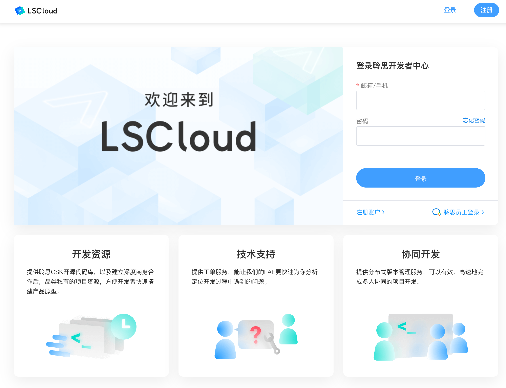
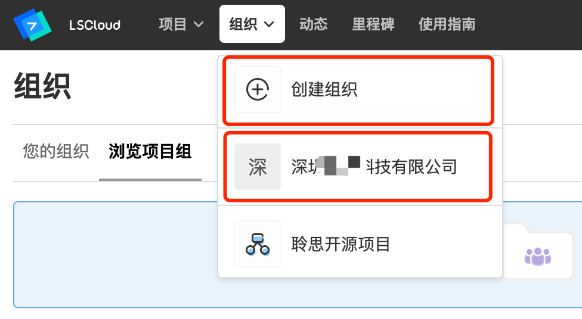
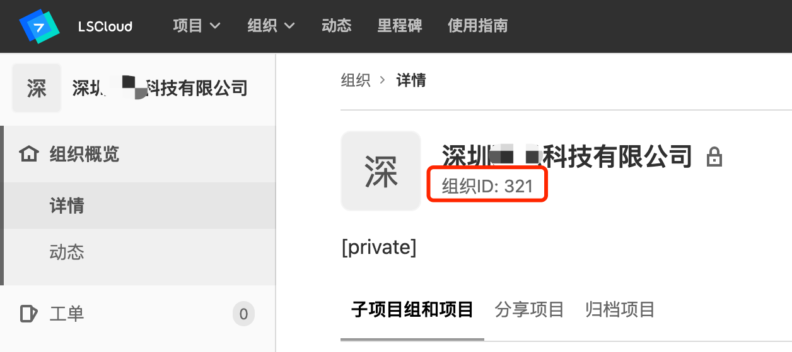

# LSCLOUD FAQ

## 组织ID获取方式

### 概述

组织ID是公司企业在聆思开发者平台的唯一凭证，通过组织ID，系统会自动把聆思的FAE拉入该组织下，以便实现工单问题的跟踪和回复。

### ID获取步骤

1. 注册并登录LSCloud，链接：https://cloud.listenai.com

2. 点击“组织 → 创建组织”进行组织创建，若已有组织则在组织列表点击公司名称进入组织详情。

2. 在组织详情页面复制此处的组织ID，提供给对接的销售即可。

## 操作权限说明

### 名词说明

组织：代表聆思的商业合作的公司和开源合作团体等，是LSCloud使用各版块权限的基础组织架构。

项目：LSCloud的私有项目或聆思开源项目；

项目组：多个项目的集合，运作方式类似文件夹。

组织的主要角色如下：
• 创建者：组织的创建人，拥有组织的全部权限；
• 管理员：组织的管理者，拥有变更创建者以外的所有权限；
• 开发者：仅可以参与被授权的项目的开发工作；
• 访客：仅可以访问被授权的项目，所在项目只有只读权限。

### 组织

不同角色在组织下拥有的权限：

| Action           | 访客 | 开发者 | 管理员 | 创建者 |
| :--------------- | :--- | :----- | :----- | :----- |
| 创建项目组       |      |        | ✓      | ✓      |
| 移除项目组       |      |        | ✓      | ✓      |
| 项目组下创建项目 |      |        | ✓      | ✓      |
| 管理组织成员     |      |        | ✓      | ✓      |
| 管理项目成员     |      |        | ✓      | ✓      |
| 管理项目组成员   |      |        | ✓      | ✓      |

### 项目

不同角色在项目中拥有的权限：

| Action             | 访客 | 开发者 | 管理员 | 创建者 |
| :----------------- | :--- | :----- | :----- | :----- |
| 拉取项目代码       | ✓    | ✓      | ✓      | ✓      |
| 下载项目           | ✓    | ✓      | ✓      | ✓      |
| Pull Request       | ✓    | ✓      | ✓      | ✓      |
| 创建工单           |      | ✓      | ✓      | ✓      |
| 提交代码           |      | ✓      | ✓      | ✓      |
| 查看合并请求列表   |      | ✓      | ✓      | ✓      |
| 管理／接受合并分支 |      | ✓      | ✓      | ✓      |
| 创建合并请求       |      | ✓      | ✓      | ✓      |
| 创建新的分支       |      | ✓      | ✓      | ✓      |
| 创建项目           |      |        | ✓      | ✓      |
| 移除项目           |      |        | ✓      | ✓      |

项目的访问权限：管理员/创建者默认可访问组织下的所有项目，开发者/访客只能访问被授权的项目。