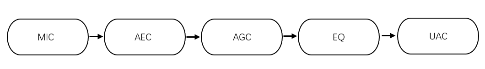
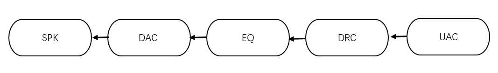

# 会议降噪进阶开发


| 版本 | 变更记录 | 变更人         | 审核 | 时间       |
 - | - | --------- | -------------- | ---- | ---------- |
| V1.0 | 初版     | 覃晓庆 |    唐京    | 2022/05/07 |

 
 

> 通过本篇文章你将了解到：
- 降噪方案的音频链路和工作原理
- AGC、DRC、EQ等各个算法模块的使用和参数调节

## 音频链路
### 上行音频链路


### 下行音频链路


## 链路模块工作原理和使用
### 1.mic录音
- adc mic增益调节
mic增益请参考-[设备调优指导](http://docs.listenai.com/Industrysolution/Conference_calling_solutions/Optimization/auto_optimize)

- 使用工具配置adc增益
会议宝调优文档-[下载](files/会议宝调优指导.pdf)    
会议宝调优工具[-下载](https://iflyos-external.oss-cn-shanghai.aliyuncs.com/public/lsopen/%E9%80%9A%E8%AF%9D%E9%99%8D%E5%99%AA/%E4%BC%9A%E8%AE%AE%E5%AE%9D%E8%B0%83%E4%BC%98%E5%B7%A5%E5%85%B7.7z)     
**注意**:自动调优工具仅适用 **蓝牙会议机方案**

### 2.CAE算法模块
CAE全称：麦克风阵列语音增强  
CAE算法包含的基本功能：  

- **回声消除AEC**
```
回声消除能力可调参数：cae_aes_floor  
可调范围：0~6, 0最强,6最弱  

默认配置：cae_aes_floor:0  
```
- **自动增益控制AGC**


```
targetLevelDbfs：AGC增益控制目标幅值
limiterLevelDbfs：AGC增益控制最大幅值

示例配置：
"targetLevelDbfs": 10,
"limiterLevelDbfs": 9,
```

如上图所示，AGC整体幅值控制在-10db~-9db范围,整体幅值趋于平稳,有效改善进场远场声音信号幅值差异较大问题。

- **环境噪声抑制**
```
可调参数：cae_nn_denoise_floor 
可调范围：0~1000
0最强，1000最弱

默认配置：
cae_nn_denoise_floor:0
```

键盘敲击噪声环境下，噪声抑制功能打开和关闭前后对比：
关闭：


打开：

从上图对比可以看到，当噪声抑制功能打开后，键盘敲击噪声被很好的抑制了。

- **去混响**   

什么是混响？
混响，是在一个空间内，声源停止发音后，声音继续存在、反射的声学现象。即直达声与经过多次反射的声音叠加在一起，会影响语音的清晰度和可懂度。

```
混响功能开关：
cae_low_delay

1：关闭去混响功能
0：打开去混响功能

默认配置：
cae_low_delay: 0
```
**CAE关键能力参考指标：**  

**混响能力：**  
- 主观效果：  
1.5s混响环境，基本无回声泄露，清晰通话；  
- 客观效果：  
0.25~0.45s （Zoom）0.4~0.7s (Teams）环境，测试满足通话效果要求  

**降噪能力**  
- 客观效果：  
噪声抑制能力10-25dB  
N-Mos分4.2-4.3分  

**回声消除能力：**  
- 客观效果  
喇叭到麦克风出能量，小于92-95dB可控制（电声结构达到算法准入门槛）  

### 3.EQ模块
EQ又称为均衡器，用于调节音调，补偿高、中、低音的频率。  

#### 3.1上行EQ调节
**安装Spyder软件**  

辅助工具下载[Spyder下载](https://iflyos-external.oss-cn-shanghai.aliyuncs.com/public/lsopen/%E9%80%9A%E8%AF%9D%E9%99%8D%E5%99%AA/Spyder_64bit_full.exe)


**eq基础文件**
[eq_param.py](./files/eq_param.py)


关键代码段：
```
def SEND_PATH():
    N  = 256;
    FS = 16000;
    X = np.arange(N)
    for i in range(0, N):
        X[i] = i*((FS/2)/N);

    param_ba = [] 
      
    b, a, ba, w, h0 = eq_param('peaking',  N, FS,  2500, -5, 1);   param_ba += ba; 
    b, a, ba, w, h1 = eq_param('peaking',  N, FS,  7500, 3, 1);    param_ba += ba; 
    b, a, ba, w, h2 = eq_param('peaking',  N, FS,  200, -2, 2);    param_ba += ba; 
    

    h = h0 * h1 * h2 

    response_plot('', X, h);
    log_file(h)
    log_param_ba(param_ba)

```

**EQ曲线**  
EQ基础文件通过Spyder可以预览曲线图  

**导入文件：**

**曲线图**


**EQ调节示例**
上行EQ曲线不达标示例：


调整方向：
针对200~400HZ频段和5K以上频段进行调整,本示例通过peak尖峰滤波和high shelf高架滤波器对曲线进行调整。

默认参数：
```
    b, a, ba, w, h0 = eq_param('peaking',  N, FS,  2500, -5, 1);   param_ba += ba; 
    b, a, ba, w, h1 = eq_param('peaking',  N, FS,  7500, 3, 1);    param_ba += ba; 
    b, a, ba, w, h2 = eq_param('peaking',  N, FS,  200, -2, 2);    param_ba += ba; 
```
默认EQ参数曲线：


调整后参数
```
    b, a, ba, w, h0 = eq_param('peaking',  N, FS,  220, 12, 4);        param_ba += ba;
    b, a, ba, w, h1 = eq_param('peaking',  N, FS,  320, 9, 4);        param_ba += ba;

    b, a, ba, w, h2 = eq_param('peaking',  N, FS,  900, 6, 3);      param_ba += ba;
    b, a, ba, w, h3 = eq_param('peaking',  N, FS,  1460, -2, 4);      param_ba += ba;
  
    b, a, ba, w, h4 = eq_param('peaking',  N, FS,  3400, -6, 3);      param_ba += ba; 
    b, a, ba, w, h5 = eq_param('peaking',  N, FS,  5450, 6, 4);       param_ba += ba; 
    b, a, ba, w, h6 = eq_param('HighShelf', N, FS, 6500, 15, 1);      param_ba += ba;  
```
调整后EQ参数曲线：


调整后上行音频曲线


**滤波器接口：**
```
eq_param(filter_type, N, fs, fc, gain, Q):

Args:
    filter type:滤波器类型
    fs: Sampling frequency
    fc: Center frequency 目标频点
    gain: Gain 增益(值越大幅值约高)
    Q: Q factor (Q值越大频弧度越大)
```
**常用滤波器：**
    allpass ：全通滤波器   
    bandpass：带通滤波器，允许一定频率内通过。    
    notch filter：陷波滤波器，压制中心频率的增益和频率响应。  
    Lowpass(high-cut)：低通滤波器    
    highpass(low-cut)：高通滤波器    
    low shelf：低架滤波器，切断中心频率以下的频率：可调节增益。  
    high shelf：高架滤波器，切断中心频率以上的频率：可调节增益。  
    peak(Bell)：尖峰滤波，拉高中心频率增益和频率响应。  

    替换EQ头文件到固件编译烧录   
    将eq_param.py运行生成的头文件eq_param.h替换源码src/algos/eq_param.h后编译烧录即可生效。  

#### 3.2下行EQ调节
下行EQ调节方式和上行EQ调节方法基本原理相同，在项目中的修改点略有差异。  

**eq基础文件**
[eq_param.py](./files/eq_param.py)  

**首先 通过Spyder工具导入eqpython文件生成EQ配置**
```
eq_param[] = /* b0, b1, b2, -a1, -a2 */ 
{0.97567403, -1.9513481,  0.97567403,  1.9505956, -0.9521006, };
```
**其次，降配置修改到CSK代码**
```
#define TARGET_CASCADE_STAGE (n)//这里的n需要根据实际有几段EQ就设置为对应的数值
说明：py文件中用到了n组配置就对应n阶，例如以下例子只用到了1组参数，则1阶


b, a, ba, w, h0 = eq_param('HPF', N, FS,  300, 0.1, 0.8);       
param_ba += ba; 
    h = h0
    response_plot('', X, h);
    log_file(h)
    log_param_ba(param_ba)

```

将EQ参数配置到项目代码中:

task_i2s_spk.c
```
static float32_t coeff[MAX_CASCADE_STAGE*5] = {
    0.97567403, -1.9513481, 0.97567403, 1.9505956, -0.9521006,  
    1,      0,      0,      0,      0,
    1,      0,      0,      0,      0,  
    1,      0,      0,      0,      0,  
    1,      0,      0,      0,      0,  
    1,      0,      0,      0,      0,      
    1, 0, 0,    0, 0,
    1, 0, 0,    0, 0,
    1, 0, 0,    0, 0,
    1, 0, 0,    0, 0,
};
注意：保持EQ参数数组的结构，不需要生效的配置端用1, 0, 0, 0, 0,取代，例如上述EQ配置中实际只有第一段配置具有实际意义，剩余配置都为空配置。
```

### 4.DRC模块
DRC 基本信息：  
Dynamic Range Control (DRC)动态范围控制提供压缩和放大能力，可以使声音听起来更柔和或更大声，即一种信号幅度调节方式.
DRC 可以做的事情：
- 根据环境匹配音频信号电平：也就是杜比volume leveler的作用；
- 保护ADC使其不会过载：在音频领域，将数字音频信号送到DAC之前，音频智能功放算法中的DRC可以实现扬声器振幅保护和功率的控制；
- 优化信息：也就是使音频信号使用到满幅的动态范围；
- 压制低电平的噪声：DRC的噪声门有一定的降噪效果；

DRC的增益调整基本上是三段：对底噪，中等幅度信号，幅度较大的信号的三段不同的处理，比如：

底噪：Cutoff，attenuation   
中等幅度信号：Expander   
幅度较大，防止削顶的：Limiter  

以上是DRC的基本信息，在会议降噪项目中，我们采用了国内先进的DRC算法，实现了音频动态范围的精准控制。

完整的DRC配置参数：
```
"drc": {
            "at": 1,
            "rt": 200,
            "segnum": 3,
            "drc_dot": [
            	{
                    "dot_x": -100,
                    "dot_y": -100,
                    "dot_w": 0
                },
                {
                    "dot_x": -20,
                    "dot_y": -17,
                    "dot_w": 0
                },
                {
                    "dot_x": -6,
                    "dot_y": -6,
                    "dot_w": 0
                },
                {
                    "dot_x": 0,
                    "dot_y": -6,
                    "dot_w": 0
                },
                {
                    "dot_x": 0,
                    "dot_y": -6,
                    "dot_w": 0
                },
                {
                    "dot_x": 0,
                    "dot_y": -6,
                    "dot_w": 0
                },
                {
                    "dot_x":0,
                    "dot_y":-6,
                    "dot_w":0
                },
        	]
        }
    },
```
对应的DRC曲线：


**at值和rt值的调节**
```
 "at":0.001,//float At; 启动时间,单位：s
 "rt":0.2,//float Rt; 释放时间，单位：s
```
当我们不确定需要多少的启动和释放时间时，我们可以先设置为0，在at和rt值为0的调节下去确认临界点。

**拐点的宽度参数调节**
```
"dot_w":0 //拐点的宽度
```
当我们不确定需要的拐点宽度时，我们可以先设置为0即硬拐点，在at和rt值为0的调节下去确认临界点。  

**DRC段数设置**

```
"segnum": 3,//int SegNum DRC段数设置
```

**验收指标示例：**  
播放1KHZ 0db 喇叭输出的额定功率：2W
播放1KHZ -6db 喇叭输出额定功率：2W
DRC需要把喇叭最高的输出功率控制在2W以内

**DRC曲线调节步骤：**    
1.确定DRC压制的临界点  
- 搭建基本的硬件条件  
- 设备功放接负载（用电阻取代喇叭），关闭DRC （bypass）测量达到额定功率时需要的1Khz 信号的幅值（例如1KHZ 0db -6db）能达到这个功率。  

2.确定临界点的坐标
- DRC曲线坐标(x,y) --x代表音频的分贝，y-x =n n>0则增强 n = 0 则维持现状 n<1 则压制 
- 从步骤1可以得到超过-6db DRC就需要开始抑制，那么临界点的坐标应为（-6，-6），超过临界点的部分音频需要压制到和临界点y轴一样的幅度，那么可以确定最终坐标点位：（0，-6）

3.确定小信号放大幅度
以5端DRC为例，当确定DRC的抑制临界点之后，可以对临界点之前的音频段进行调节：
```
        {
        "dot_x":-40,
        "dot_y":-40,
        "dot_w":0
        },
        {
        "dot_x":-20,
        "dot_y":-17,
        "dot_w":0
        },
        {
        "dot_x":-6,
        "dot_y":-6,
        "dot_w":0
        },
```
同样调节y轴的值，达到增大的目标。

### 5.SPK音量控制

SPK音量软件调节：
```
#define SPK_VOL_DB_MAX	(-1.5f)
#define SPK_VOL_DB_MIN	(-25.f)
#define SPK_VOL_DB_DEF	(-8.0f)
```
理论上SPK_VOL_DB_MAX最大值为0，当音量值设置为0后依然无法达到音量分贝要求，则需要调整功放电路硬件提高输出功率。
