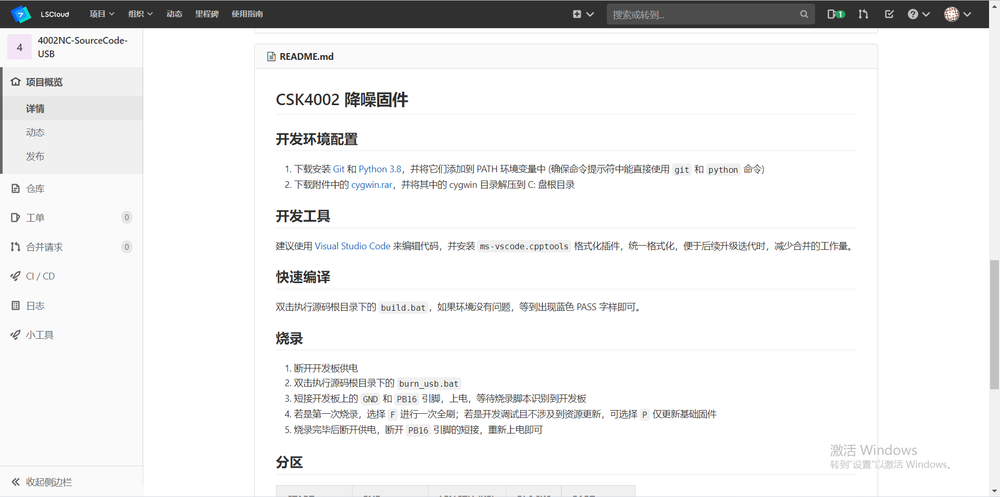
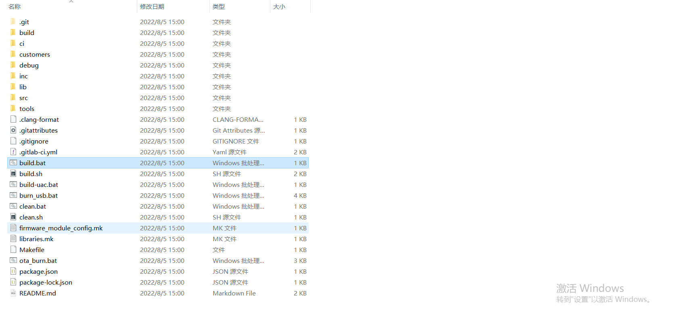
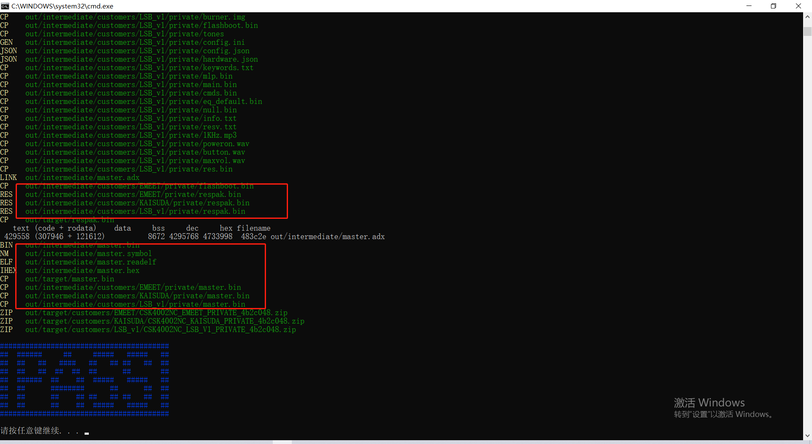
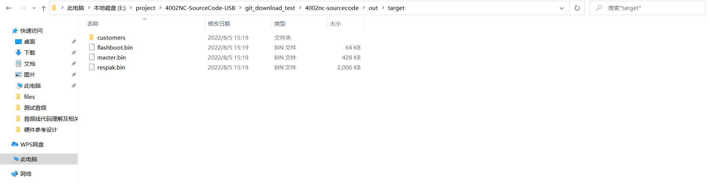
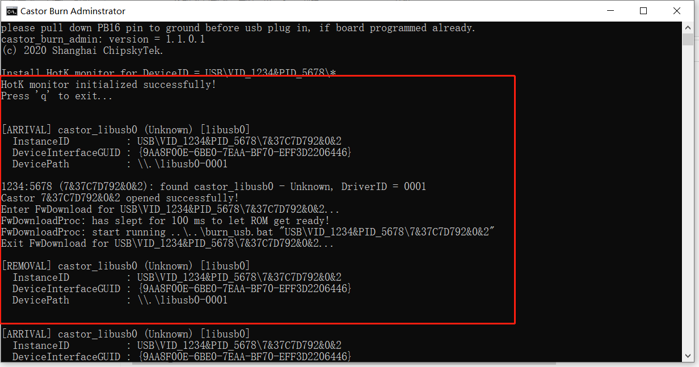
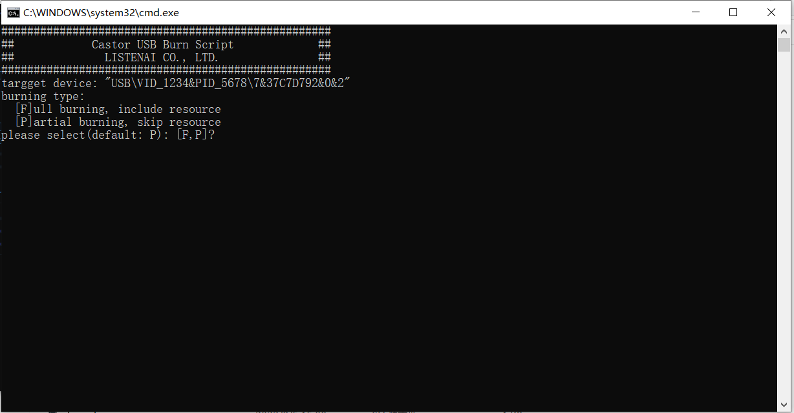
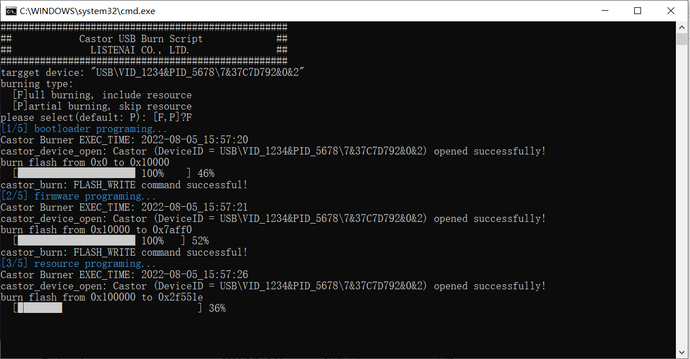

# 快速入门

:::tip 注意

聆思的开发环境目前基于windows环境下开发使用！！！

:::

## 获取代码

代码放在聆思服务器上的git仓库，请确认你已经与聆思签署NDA协议以及聆思相关人员已经为你开通了权限，代码仓库路径如下：[点击跳转到代码仓库](https://cloud.listenai.com/private/AI-audio/4002nc-sourcecode)，如果你跳转后的路径显示不正常，请联系聆思为你开通对应权限。显示正常的页面可以看到如下内容：

代码页面最下面可以看到README.md文件，如下图所示：

README记录了需要配置的环境，请先按照README.md描述，先配置`git`及`python`环境，再按提示下载`cygwin.rar`及解压到C盘根目录，这样，你的代码开发环境基本准备好了。

接下来，确保你的git设置了相应的令牌及ssh key之后，你可以点击页面中的**克隆**，弹出的链接，并使用`git clone`克隆代码即可。

代码克隆下来之后，默认是在master分支，请使用git checkout切换到**4.6.1-rel**分支，**4.6.1-rel**分支的代码即是我们使用的代码。代码目录结构如下图所示：

## 固件编译与烧录

### 编译

在代码目录中直接双击`build.bat`即可开始编译。编译过程如下：

编译完成后可以看到提示`out\target`目录下生成`master.bin`、`respak.bin`及`flashboot.bin`，并且没有报错即表示编译成功。（注意：**编译结束后的pass提示不能表示编译成功，请依据编译过程无报错，并提示生成上述三个bin文件为准**）。

###  烧录固件

**请确保你板子上的烧录引脚已经引出，烧录前请将烧录引脚拉低后给板子上电，使板子进入烧录模式。**

板子进入烧录模式之后，在代码目录中，双击`burn_usb.bat`文件，开始烧录，烧录过程分别出来两个界面，正常情况下第一个界面弹出后大概1-2秒，会弹出第二个页面，提示按`F`或`P`键，按`F`表示`全部烧录`，按`P`表示`部分烧录`，不按按键的时候，大概3-5秒后，默认会开始`部分烧录`，正常情况下，我们按`F`键进行全部烧录。

第一个界面如下所示（如果第一个页面弹出后停止在 Press ‘q' to exit不动，代表板子可能没进入烧录模式，请重新断电让板子进入烧录模式再双击`burn_usb.bat`文件）：

第二个界面如下：

按`F`键之后开始全部烧录：

看到运行条在走动即表示正在烧录且烧录过程顺利，烧录完成后第二个界面会自动退出。

如果硬件设计及接口均与我方推荐的硬件电路接口一致，烧录成功后，重新插拔上电，听到扬声器播放出的提示音，那么恭喜你，一切顺利。
