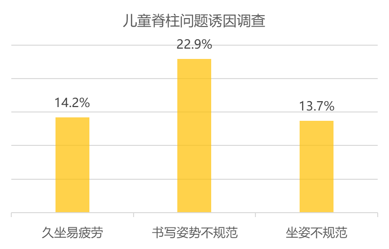
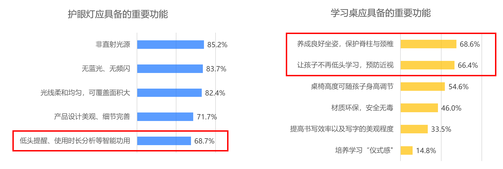
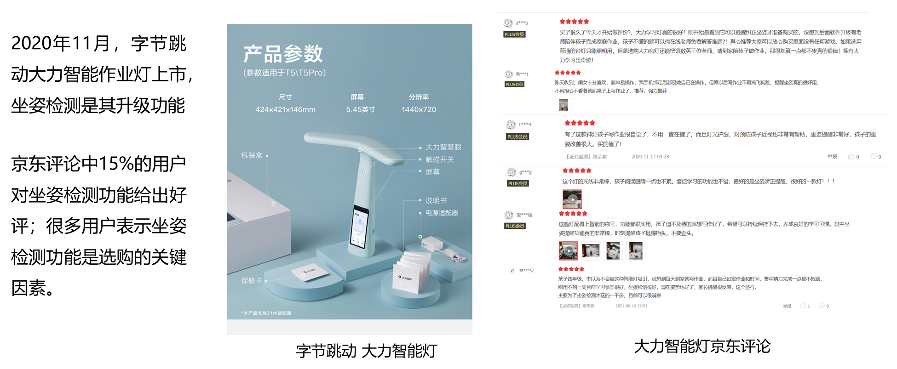
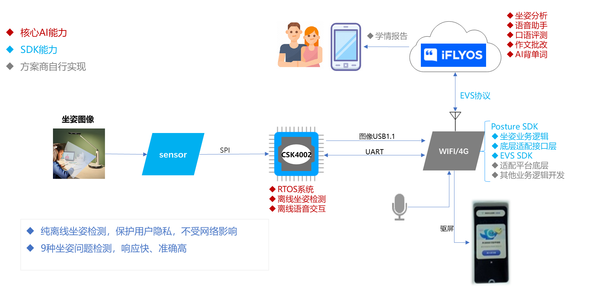
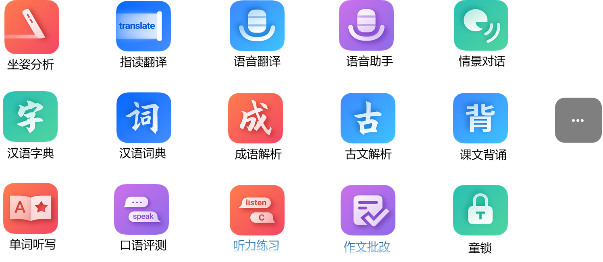
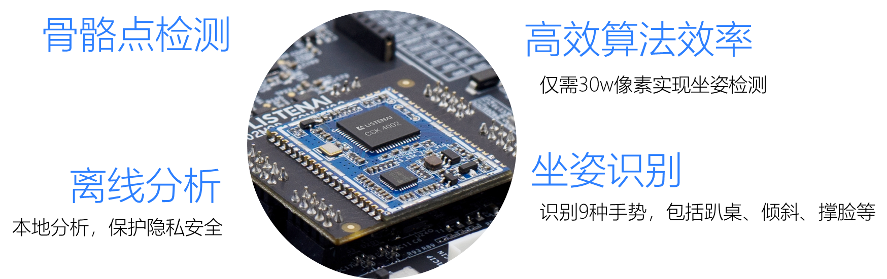
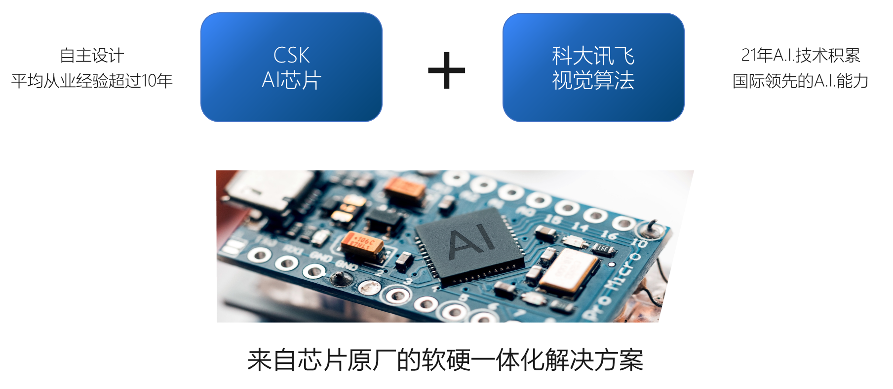

# 方案介绍
> 通过本篇文章你将了解到：
1. 坐姿检测市场解读
2. 聆思坐姿台灯方案框架
3. 聆思坐姿台灯方案核心能力
		
		
## 坐姿检测市场解读
受读写姿势不规范等原因，我国儿童视力与脊柱健康问题非常突出。2018年全国青少年总体近视率达到53.6%，其中小学生为36%，高中生高达81%。

目前，功能性儿童学习用品主要分为**儿童护眼灯**和**儿童学习桌**，通过特殊设计保护儿童视力与脊柱健康。而随着行业发展和市场扩大，用户群体的需求与行业内部的竞争促进了产品种类丰富与功能升级。其中坐姿和近视问题备受家长关注。

## 市场成功案例
**“大力智能灯”坐姿检测功能备受好评。**

## 坐姿检测市场前景广阔

# 聆思坐姿台灯方案
聆思提供硬件成本低、算法体验好、落地效率高的云端芯扫描笔解决方案。

1. 仅需30W像素镜头模组，保持极致的性价比。
2. AI芯片CSK离线可运行坐姿检测算法。
3. 支持9种不同姿态的检测，检测**准确率>97%**，**响应快（17.3ms）**。
3. 提供现成上位机SDK，供方案商快速接入。
4. 提供稳定运行的iFLYOS云端内容服务平台。

## 坐姿检测Turnkey方案架构

## 云端芯侧提供丰富的功能应用

# 聆思坐姿台灯核心能力
## 先进的视觉算法

## 聆思软硬件一体解决方案

