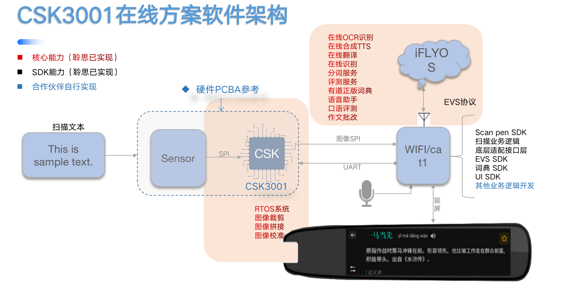
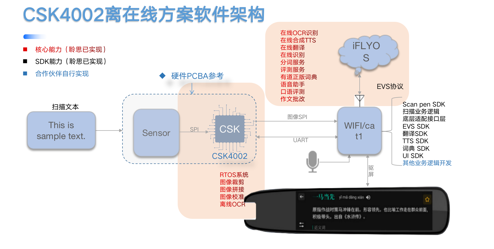
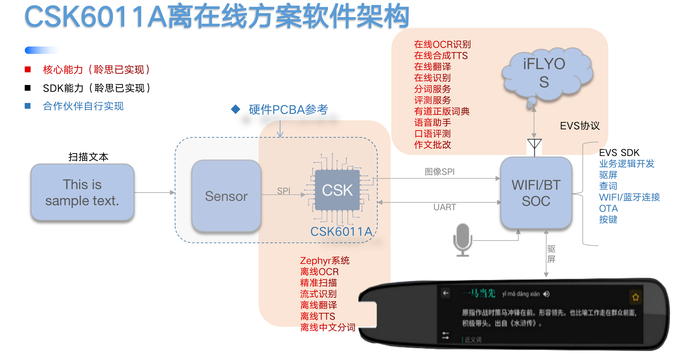
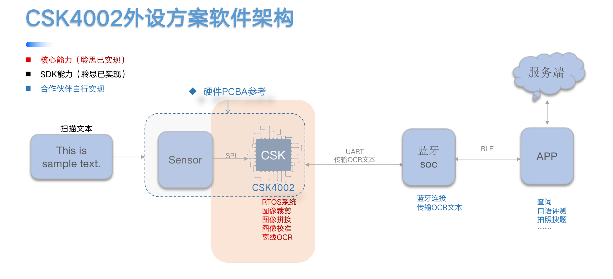
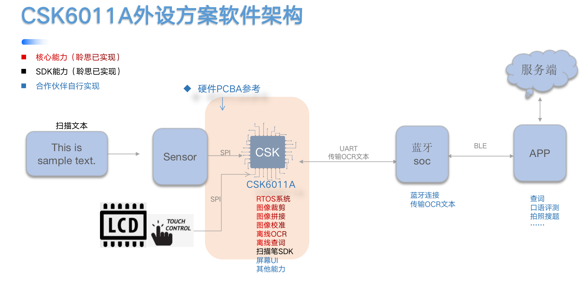
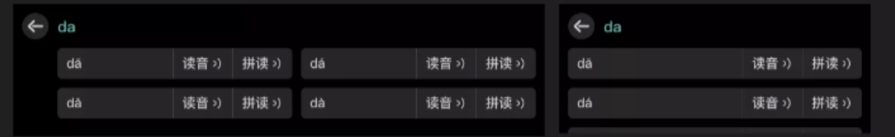
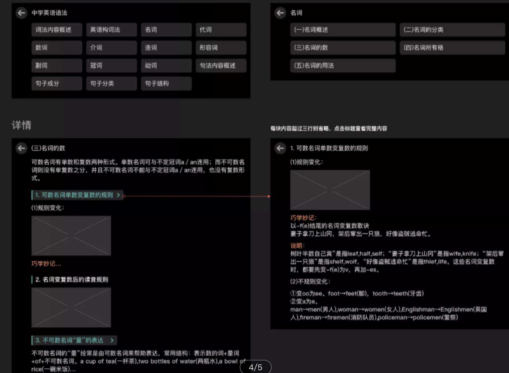
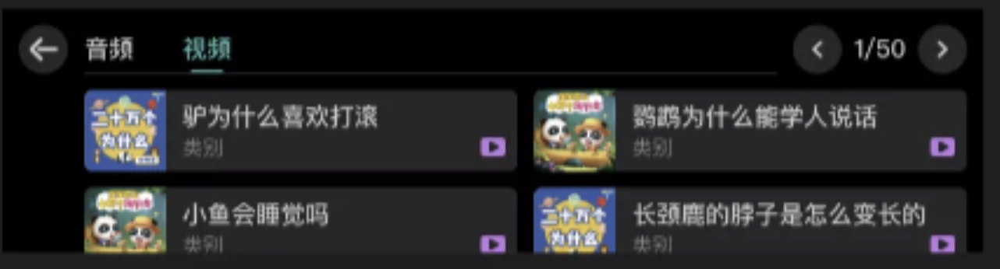

# 聆思扫描笔方案白皮书

> 阅读本文，你可以了解到：
1. 扫描笔市场解读。
2. 聆思扫描笔方案介绍

| 版本 |	变更内容	 |编写人 | 	日期|
| :-| :- | :- | :- |
|V1.0 |	First Release	|刘钟蔚	|2022.04.05|
|V1.1 | 新增6011A离在线方案和外设方案介绍；新增方案离线能力介绍部分；	|刘钟蔚	|2022.07.07|

## 方案背景

在中国智能硬件市场飞速发展的背景下，扫描笔作为学生查词学习的工具，用其更高效的体验代替过往电子词典，市场规模逐年增长。

在这个过程中，知名品牌起到了行业推动型的作用，如有道、科大讯飞，推出自身的千元级旗舰机型扫描笔产品，用其出色的内容质量和产品体验，在市场上获得大量的用户认可，一时间，传统教育品牌、教培机构、互联网大厂也纷纷入局，行业中的产品和方案百花争鸣。
我们可以看到市场的方案分为两种，第一种是品牌方案，这一类方案以安卓和Linux平台为主，特点是芯片平台性能强大，端侧可以实现完整的扫描笔算法能力，以及有足够的空间容量放下音视频类的学习资源，但缺点是平台功耗高，价格贵，算法适配和调优周期长。长期来看，扫描笔作为教育工具类产品，未来用户对平台的耗电、价格、算法性能的要求会越来越高，品牌需要在产品迭代和产品矩阵拓展的过程中，寻找更符合产品使用场景的平台。

第二种方案是低价市场的方案，该市场一直存在杀价严重、产品同质化的情况，方案商因为过多的关注价格，在稳定性、内容质量上就不自而然的做出妥协，伤害了用户体验。

聆思扫描笔方案以自研AI芯片和融合算法为核心，在稳定服务和内容和效果质量保障的基础上，进一步提供满足客户方案自定义的解决方案。

我们认为，方案的输出是满足市场需求的行为外，也代表了一种价值观。通过方案的输出，能让行业中的各个玩家会更加关注在竞争力和差异化上的打磨，持续输出好产品，产生用户价值，让用户为之付费，该方案就是成功的。

## 方案介绍

### 方案特性

- 基于聆思自研AI芯片CSK3/4/6X，采用NPU+MCU双核架构，最大算力可达128GOPS，性能强大；使用RTOS系统，相对安卓/Linux系统更低成本，功耗更低，启动速度更快；
- 芯片深度耦合讯飞神经网络算法，保证扫描笔算法效果领先性；
- 提供正版版权词典、K12课外中文音频、学习园地、语音评测、口语练习、英语作文批改等多种教育能力；
- 自定义程度高，端侧可搭配其他芯片平台（cat1/安卓/Linux），形成不同的方案；云端调用链路支持自定义化，帮助客户进一步实现实现产品差异化；

### 方案对比

|能力|	聆思|	其他方案|
| :-| :- | :- |
|芯片平台|	RTOS平台，启动快，功耗低，支持离在线|	安卓/LINUX：价格贵、功耗高；RTOS 只能做纯在线；|
|AI算法|	科大讯飞提供扫描笔所需算法：OCR、翻译、TTS，集合高算力芯片发挥发挥最优效果；|	需原厂配合集成，调优、迭代时间长；|
|教育内容	|正版版权词典、讯飞核心教育算法（国家测试级语音评测、英文作文批改等）；|	非正版内容，产品教育能力弱；|
|云端平台	|iFLYOS平台四年稳定运行，支持1000+客户，服务千万用户；|	第三方服务器存在不稳定、服务抖动、服务关闭等风险；|自研平台成本高；|
|自定义能力	|端侧：端侧可搭配其他芯片平台（cat1/安卓/Linux），形成不同的方案；云侧：支持自定义链路配置，快速打造差异化产品；|	沟通成本和研发成本高 |

## 方案矩阵

### 主机方案

| 方案类型	| 纯在线/4G方案	| 离在线方案	| 离在线方案|
| :-| :- | :- | :- |
| 方案配置|	CSK3001+WIFIsoc/cat1|	CSK4002+WIFIsoc|	CSK6011A+XR819s|
| 离线能力	 | CSK：离线裁剪、离线拼接；上位机：连接网络	|CSK：离线裁剪、离线拼接、离线OCR；上位机：离线翻译、离线TTS、离线查词|	CSK：离线裁剪、离线拼接、离线OCR、离线翻译、离线TTS、离线查词（资源3MB）|
| 方案特点|	相比纯WIFI方案，低宽带情况下（30Kbps）依旧可用；|	CSK4002可搭配任意上位机（安卓/linux），形成全套扫描笔离在线方案；|	目前业界唯一的低成本RTOS离在线方案；|
| 方案介绍|	[点击查看](#csk3001纯在线4g方案)|	[点击查看](#csk4002离在线方案)	|[点击查看](#csk6011a离在线方案)|

### 外设方案

|方案类型	|外设（不带屏）|	外设（带屏）|
| :-| :- | :- |
|方案配置|	CSK4002+任意蓝牙soc	|CSK6011A+任意蓝牙soc|
|离线能力|	CSK：离线裁剪、离线拼接、离线OCR；蓝牙：连接小程序/APP|	CSK：离线裁剪、离线拼接、离线OCR、离线查词；蓝牙：连接小程序/APP|
|方案特点|	低成本RTOS外设方案，产品设计上不可带屏幕；|	低成本RTOS外设方案，产品设计上可带屏幕；|
|方案介绍|	[点击查看](#csk4002外设方案) |[点击查看](#csk6011a外设方案)|

## 方案说明

### CSK3001纯在线/4G方案

#### 方案介绍

配置：CSK3001+WIFIsoc/cat1；

特性：相比纯W0Kbps）低宽带情况下依旧可用；

#### 方案架构

#### 能力说明

##### 离线拼接
支持每秒输入66帧~120帧中文/英文单词的图片拼接；

##### 在线能力
在线能力见“[云端能力说明](#云端能力说明)”；

### CSK4002离在线方案

#### 方案介绍

配置：CSK4002+WIFIsoc（上位机）；

特性：CSK4002可搭配任意上位机（安卓/linux），形成全套扫描笔离在线方案（离线OCR+离线翻译+离线TTS+离线查词）；

#### 产品架构

#### 能力说明
##### 离线OCR
介绍：
基于讯飞自研深度神经网络模型的端到端文字识别系统，将扫描到课本教材和儿童读物的内容，直接转换为文本，实现高精准、毫秒级识别体验。

能力说明：
- 支持识别5000+常用汉字、26个英文字母、常用中英符号；
- 支持标准字体：二号字及以下，高对比度（浅底深字，深底浅字）；
- 待优化效果：生僻字、形近字；
- 待支持识别：拼音；
- 不支持：希腊字母（α、β等）、繁体字、空心字体、低对比度（绿底黄字，粉底白字等）；
- 准确率：
    - 纯中文字确率：92%。
    - 纯英文字确率：92%
    - 中英文混合字确率：90%
- 扫描速度：A4纸一行支持1.5s内扫完；

性能要求：
- OCR在该方案中主要集成于CSK，客户无需关注。

##### 离线翻译
介绍：
基于自主研发的多语种机器翻译引擎，采用新的神经机器翻译理论和技术，满足用户的文字、语音翻译需求。

特性：
- 英语六级翻译水平，翻译自然
- 翻译速度快，毫秒级响应

能力说明：
- 支持中、英互译；
- 英语六级翻译水平，上下文关联能力强；
- 专有名词、短语片段翻译效果一般；
- 响应时间：300~400ms；
- Bleu分大于30（Bleu(bilingual evaluation understudy)是一种机器翻译的评测算法，用于评估一种自然语言翻译成另外一种自然语言的翻译质量，一般来说，机器译文与参考译文计算后的BLEU分越高，翻译的效果越好）；

性能要求：
- 翻译算法需集成于安卓.liunx上位机：
    - 四核（翻译需独占一个核）；
    - 空闲内存>128MB；
    - 空闲存储>256MB，DDR2以上；
    - 主频>800MHz（需关注有无NEON加速）；

##### 离线语音合成
介绍：
将文字信息转化为声音信息，同时提供了众多极具特色的音库供产品选择发音人。

特性：
- 多种发音人可选择
- 合成自然度业内最高，无限逼近真人发音
- 合成速度快，毫秒级响应

能力说明：
- 支持10+种男女、少儿发音人选择，推荐（推荐虫虫、倩倩，双语综合效果最佳）。
- 响应时间：200~400ms

性能要求： 
- 离线语音合成需集成于安卓.liunx上位机：
    - CPU：cortex-A7 主频1.2Ghz+ 
    - 空闲内存>40MB；
    - 空闲存储>30MB；

##### 离线查词
介绍：学王正版词典；

特性：
- 正版版权词典；
- 真人发音、释义丰富；

内容说明：
- 汉字词典：参考：GB2312 6763字，GBK21886字，GB18030 7万字；包含结构、释义、描红、近反义词、真人发音等；
- 词语词典：参考：《汉语大辞典》词语，50万+；包含拼音、释义、造句、近义词、反义词等；
- 成语词典：参考：《汉语大辞典》成语4万个；包含典故、注音、释义、近反义词、用法、感情色彩、常用程度等；
- 古诗词词典：囊括中小学教材中各个时期具有代表的诗词典文言文，共300+首；包含字解，译文，赏析等；
- 英汉词典：小学到大学，教材中出现的单词，4万+；包含英式发音、美式发音、自然拼读、例句等；

性能要求： 
- 可视客户上位机空间大小自定义裁剪；
    - 最大资源包2.5GB，包含汉字、词语、成语、古诗词、英汉词典；汉字描红和发音；单词英美发音；
    - 最小资源包3MB，包含3000汉字、20000单词的基础释义；

##### 在线能力
在线能力见“[云端能力说明](#云端能力说明)”；

### CSK6011A离在线方案

#### 方案介绍
配置：CSK6011A+XR819s；
特性：目前业界唯一的低成本RTOS离在线方案（离线OCR+离线TTS+离线翻译+离线查词）；

#### 产品架构

#### 能力说明

##### 离线OCR
介绍：
基于讯飞自研深度神经网络模型的端到端文字识别系统，将扫描到课本教材和儿童读物的内容，直接转换为文本，实现高精准、毫秒级识别体验。

能力说明：
- 支持识别5000+常用汉字、26个英文字母、常用中英符号；
-  支持标准字体：二号字及以下，高对比度（浅底深字，深底浅字）；
-  待优化效果：生僻字、形近字；
-  待支持识别：拼音；
-  不支持：希腊字母（α、β等）、繁体字、空心字体、低对比度（绿底黄字，粉底白字等）；
-  准确率：
	-  纯中文字确率：92%。
	-  纯英文字确率：92%
	-  中英文混合字确率：90%
-  扫描速度：A4纸一行支持1.5s内扫完；

性能要求：
-  OCR在该方案中主要集成于CSK，客户无需关注。

##### 离线翻译
介绍：
基于自主研发的多语种机器翻译引擎，采用新的神经机器翻译理论和技术，满足用户的文字、语音翻译需求。

特性：
-  英语四级翻译水平；
-  翻译速度快，毫秒级响应；

能力说明：
-  支持中、英互译；
-  英语四级翻译水平，上下文关联能力较弱，后续会优化效果；
-  专有名词、短语片段翻译效果较差；
-  响应时间：300~400ms；
-  Bleu分大于25（Bleu(bilingual evaluation understudy)是一种机器翻译的评测算法，用于评估一种自然语言翻译成另外一种自然语言的翻译质量，一般来说，机器译文与参考译文计算后的BLEU分越高，翻译的效果越好）；

性能要求：
-  翻译算法在该方案中主要集成于CSK，客户无需关注。

##### 离线语音合成
介绍：
将文字信息转化为声音信息，同时提供了众多极具特色的音库供产品选择发音人。

特性：
-  发音自然度较弱；
-  合成速度快，毫秒级响应；

能力说明：
-  发音有机械感；
-  暂不支持发音人选择；
-  响应时间：200~400ms；

性能要求：
-  语音合成算法在该方案中主要集成于CSK，客户无需关注。

##### 离线查词
介绍：学王正版词典；

特性：
-  正版版权词典；
-  释义丰富；

内容说明：
-  汉字词典：3000常用汉字；包含结构、释义、近反义词等；
-  英汉词典：包含K12教材常见单词，2万+；包含基础释义、派生词、时态词、例句等；

性能要求： 
-  词典SDK在该方案中主要集成于CSK，资源大小上限为3MB，可视客户需求自定义；

##### 在线能力
在线能力见“[云端能力说明](#云端能力说明)”；

### CSK4002外设方案

#### 方案介绍

配置：CSK4002+任意蓝牙soc（如AC6956C）；

特性：低成本RTOS外设方案；

#### 产品架构

#### 能力说明

##### 离线OCR
介绍：
基于讯飞自研深度神经网络模型的端到端文字识别系统，将扫描到课本教材和儿童读物的内容，直接转换为文本，实现高精准、毫秒级识别体验。

能力说明：
-  支持识别5000+常用汉字、26个英文字母、常用中英符号；
-  支持标准字体：二号字及以下，高对比度（浅底深字，深底浅字）；
-  待优化效果：生僻字、形近字；
-  待支持识别：拼音；
-  不支持：希腊字母（α、β等）、繁体字、空心字体、低对比度（绿底黄字，粉底白字等）；
-  准确率：
	-  纯中文字确率：92%。
	-  纯英文字确率：92%
	-  中英文混合字确率：90%
-  扫描速度：A4纸一行支持1.5s内扫完；

### CSK6011A外设方案

#### 方案介绍
配置：CSK6011A+任意蓝牙soc（如AC6956C）；
特性：低成本RTOS外设方案，产品设计上可带屏幕；

#### 产品架构

#### 能力说明

##### 离线OCR
介绍：
基于讯飞自研深度神经网络模型的端到端文字识别系统，将扫描到课本教材和儿童读物的内容，直接转换为文本，实现高精准、毫秒级识别体验。

能力说明：
-  支持识别5000+常用汉字、26个英文字母、常用中英符号；
-  支持标准字体：二号字及以下，高对比度（浅底深字，深底浅字）；
-  待优化效果：生僻字、形近字；
-  待支持识别：拼音；
-  不支持：希腊字母（α、β等）、繁体字、空心字体、低对比度（绿底黄字，粉底白字等）；
-  准确率：
	- 纯中文字确率：92%。
	- 纯英文字确率：92%
	- 中英文混合字确率：90%
-  扫描速度：A4纸一行支持1.5s内扫完；

##### 离线查词
介绍：学王正版词典；

特性：
-  正版版权词典；
-  释义丰富；

内容说明：
-  汉字词典：3000常用汉字；包含结构、释义、近反义词等；
-  英汉词典：包含K12教材常见单词，2万+；包含基础释义、派生词、时态词、例句等；

性能要求： 
-  词典SDK在该方案中主要集成于CSK，资源大小上限为24MB，可视客户需求自定义，食量增加一些词语/成语/古诗词词典资源；

## 云端能力说明

### 在线OCR

基于讯飞自研的行业先进的光学字符识别技术，将扫描到课本教材和儿童读物的内容，直接转换为文本，实现高精准、毫秒级识别体验。

能力说明：
- 支持识别2万+汉字、26个英文字母、常用中英符号、拼音识别；
- 支持标准字体：二号字及以下，高对比度（浅底深字，深底浅字）；
- 支持生僻字、形近字识别；
- 不支持：希腊字母（α、β等）、繁体字、空心字体、低对比度（绿底黄字，粉底白字等）；
- 准确率：
    - 纯中文字确率：98%；
    - 纯英文字确率：98%；
    - 中英文混合字确率：95%；
- 扫描速度：A4纸一行支持1.5s内扫完；
- 响应速度：400ms内；

### 在线翻译

基于讯飞翻译机同源的中英互译能力，提供可靠稳定的引擎服务，满足用户的文字、语音翻译需求。

特性：
- 专八翻译水平，翻译专业
- 支持多语种翻译
- 翻译速度快，毫秒级响应
- 自动纠正

能力说明：
- 支持中、英互译；
- 英语专八翻译水平，翻译信达雅，上下文关联能力强，短语、句子翻译都有很好的翻译效果；
- 专有名词、短语片段、句子级的翻译纠正；
- 响应时间：400~500ms；
- Bleu分大于35（Bleu(bilingual evaluation understudy)是一种机器翻译的评测算法，用于评估一种自然语言翻译成另外一种自然语言的翻译质量，一般来说，机器译文与参考译文计算后的BLEU分越高，翻译的效果越好）；

### 在线语音合成

介绍：
将文字信息转化为声音信息，同时提供了众多极具特色的音库供产品选择发音人；在2008年英文合成自然度已超过人类平均水平。

特性：
- 多种发音人可选择
- 合成自然度业内最高，无限逼近真人发音
- 合成速度快，毫秒级响应

能力说明：
- 支持20+种男女、少儿发音人选择（推荐虫虫、倩倩，双语综合效果最佳）。
- 响应时间：300~400ms

### 在线语音评测

介绍：
采用中高考英语测试、普通话考试同源技术，彻底解决口语评测不准确，影响孩子发音问题。

特性：
- 国家语委鉴定，四六级考试专用技术，累计测试近亿名考生；
- 支持普通话和英文口语的字、词、句、篇章等多种题型；
- 多维度综合评分，提供准确、流畅、完整、声韵、语速等丰富维度；
- 音节粒度返回评分，准确定位发音错误；
- 音素级纠错：返回每个音节得分，精准定位错误；

### 正版词典

介绍：
提供学王正版词典，涵盖K12阶段所有需要学习词汇，即扫即学。

特性：
- 正版版权词典；
- 真人发音、释义丰富；

内容说明：
- 汉字词典：参考：GB2312 6763字，GBK21886字，GB18030 7万字；包含结构、释义、描红、近反义词等；
- 词语词典：参考：《汉语大辞典》词语，50万+；包含拼音、释义、造句、近义词、反义词等；
- 成语词典：参考：《汉语大辞典》成语4万个；包含典故、注音、释义、近反义词、用法、感情色彩、常用程度等；
- 古诗词词典：囊括中小学教材中各个时期具有代表的诗词典文言文，共300+首；包含字解，译文，赏析等；
- 英汉词典：小学到大学，教材中出现的单词，4万+；包含英式发音、美式发音、自然拼读、例句等；

### 英文学习：口语练习

**提供专业的听说训练，达到持续提高青少年口语水平的目的。**

- 多种口语练习方式：人机场景对话、课文跟读、发音评测
- 针对不同年龄段，提供不同题型：跟读、开放式、封闭式
- 正版教育版权，保证学习质量
- 持续增加题目，保持学习进度

### 英文学习：写作批改

介绍：
自动批改英文作文，智能分析智能纠错，辅助提升学生写作水平。

特性：
- 背后有英语研讨老师专业团队支持，持续优化模型，保证批改专业性；
- 40+错误语法检测，如拼写错误、语法错误、用词错误等；
- 3种文章亮点检测，如高级表达等；

### 学习园地

介绍：
提供中文和英文更多课外学习素材，加深学生知识水平，主要内容包括：拼音学习、中小学英文阅读训练、中小学英文语法学习、算数口诀。

### K12课外音频

介绍：
提供正版儿童课外的音频读物。

主要内容：
- 儿童儿歌
- 睡前故事
- 启蒙教育故事
- 百科学习

### 学情数据

介绍：
记录扫描笔使用数据，供公众号、APP接入，同步家长，生成学习报告。

特性：
- 全面记录扫描笔使用过程中产生的学习数据；
- 智能分析数据生成学习报告；
- 接口服务稳定；

主要内容：
- 扫描记录
- 翻译记录
- 评测记录
- 口语练习记录
- 作文批改记录
- 周学习报告
- ……

### 语音助手

**200 + 内置技能，覆盖K12教育、娱乐领域，免费使用。**

### 单词听写（待上线）

对齐小学课本单元标准单词库，拿起笔就可以听写单词，巩固单词记忆；

### 语文背诵（待上线）

对齐小学课本背诵要求，拿起笔就可以背诵语文课本内容，巩固背诵记忆；

## 更多资料

- [扫描笔Turnkey方案说明](/Industrysolution/Scanning_pen/Scanning_pen_turnkey)
- [CSK芯片介绍](https://docs.listenai.com/chips/4002/Chip_information_4002)
- [扫描笔云端协议开发文档](https://docs.listenai.com/Industrysolution/Scanning_pen/evs)
- [扫描笔云端API接口开发文档](https://docs.listenai.com/Industrysolution/Scanning_pen/api)

### 语音助手

# 一级标题

## 二级标题

### 三级标题

### CSK3001纯在线

### 纯在线C

### csk3001纯在线

# csk3001纯在线1